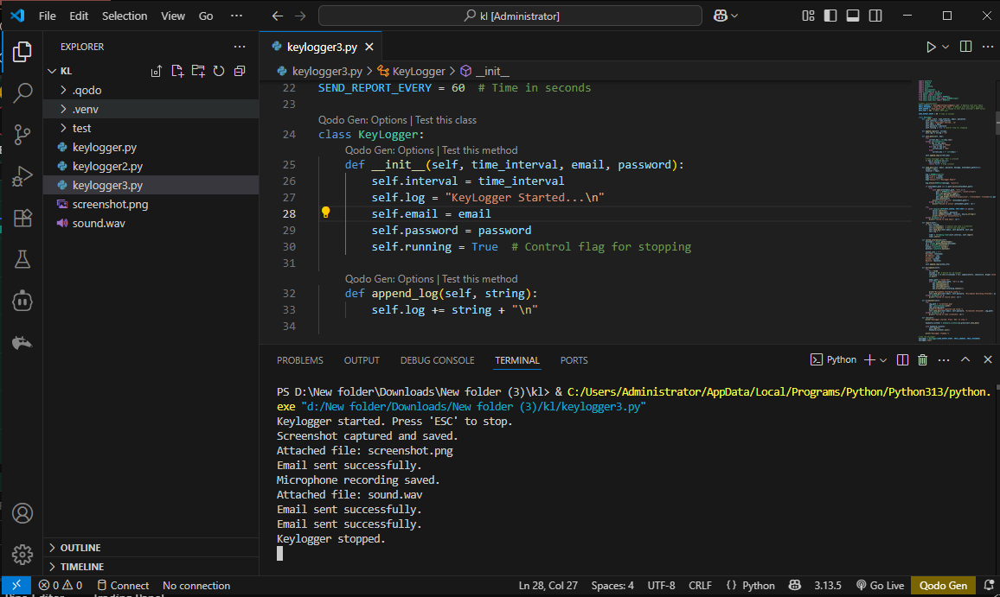
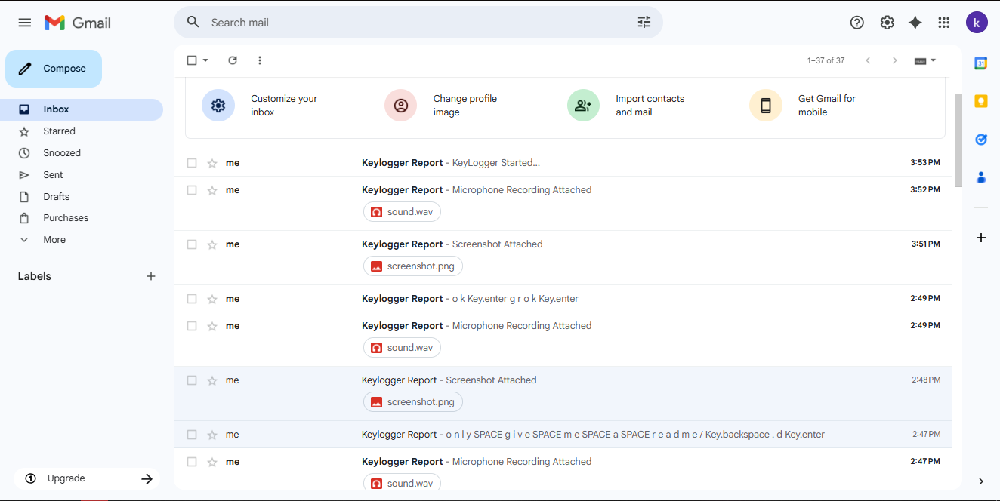

# Advanced Python Keylogger for Educational Purposes

> ⚠️ **Ethical Warning & Disclaimer**
> This software is intended for educational and research purposes only. It is designed to help users understand the potential security risks and the mechanics of how such surveillance tools work.
>
> **DO NOT** use this software on any computer or system that you do not own or have explicit, written permission to monitor. Unauthorized installation or use of this software on a system is illegal and unethical. The developer assumes no liability and is not responsible for any misuse or damage caused by this program.

## Overview

This project is a Python-based keylogger that demonstrates several surveillance techniques. It captures not only keystrokes but also system information, screenshots, and audio from the microphone, sending all collected data to a specified email address at regular intervals.


## Features

* **Keystroke Logging**: Records all key presses, including special keys like `Space`, `Enter`, and `Esc`.
* **Screenshot Capture**: Takes a screenshot of the entire screen at each reporting interval.
* **Microphone Recording**: Records a 10-second audio clip from the default microphone.
* **System Information**: Gathers basic system details (Hostname, IP Address, OS, Processor).
* **Email Reporting**: Periodically sends the collected logs, screenshot, and audio recording as attachments to a pre-configured email address.
* **Timed Reports**: Data is sent at a configurable time interval (e.g., every 60 seconds).
* **Clean Exit**: The logger can be stopped cleanly by pressing the `Esc` key.

## How It Works

The script uses several Python libraries to achieve its functionality:
* `pynput`: To listen for and record keyboard events.
* `pyscreenshot`: To capture the screen.
* `sounddevice`: To record audio from the microphone.
* `smtplib` & `email`: To send the collected data via email using an SMTP server.
* `threading`: To run the reporting function periodically without blocking the key listener.

---

## Demonstration

Here’s a quick look at the keylogger in action.

### Code Screenshot
A glimpse of the clean and well-commented Python code structure.



### Output Screenshot
Example of the console output when the keylogger starts and successfully sends a report.



### Video Walkthrough
This video demonstrates the full process:
1.  Running the script.
2.  Typing some text and pressing `Esc` to stop it.
3.  Showing the email received with the logs, screenshot, and audio attachment.

[](https://www.youtube.com/watch?v=sX4Emo-HpNU)

---

## Prerequisites

* Python 3.x
* `pip` (Python package installer)

## Installation

1.  **Clone the repository:**
    ```bash
    git clone [https://github.com/your-username/your-repository-name.git](https://github.com/your-username/your-repository-name.git)
    cd your-repository-name
    ```

2.  **Install the required Python packages:**
    ```bash
    pip install pynput pyscreenshot sounddevice
    ```
    *Note: `pyscreenshot` may require `Pillow` to be installed (`pip install Pillow`).*

## Configuration

Before running the script, you must configure your email settings directly in the Python file (`keylogger.py`).

1.  **Open the `keylogger.py` file** in a text editor.

2.  **Set your email credentials:**
    Update these variables with your own details:
    ```python
    # Email Configuration
    EMAIL_ADDRESS = "your-email@gmail.com"
    EMAIL_PASSWORD = "your-app-password"
    ```

    > **IMPORTANT SECURITY NOTE FOR GMAIL USERS:**
    > If you are using Gmail, you cannot use your regular password directly due to Google's security policies. You must enable 2-Factor Authentication (2FA) for your Google account and then generate an **"App Password"**.
    >
    > 1. Go to your Google Account settings.
    > 2. Navigate to **Security**.
    > 3. Under "Signing in to Google," select **App Passwords**.
    > 4. Generate a new password for an app (you can name it "Python Keylogger").
    > 5. Google will provide a 16-character password. Use this password for the `EMAIL_PASSWORD` variable.
    > 

3.  **Set the reporting interval:**
    You can change the time (in seconds) between email reports. The default is 60 seconds.
    ```python
    SEND_REPORT_EVERY = 60 # Time in seconds
    ```

## Usage

1.  Navigate to the project directory in your terminal.

2.  Run the script:
    ```bash
    python keylogger.py
    ```

3.  The script will start running in the background. It will print "Keylogger started." to the console.

4.  To stop the keylogger, press the `Esc` key. The script will stop listening for keys and terminate.

## License

This project is licensed under the MIT License. See the `LICENSE` file for details.

***

**Final Reminder:** This tool is powerful and intrusive. Please use it responsibly and ethically. The purpose of this repository is to learn about system security, not to violate others' privacy.
